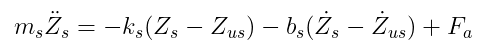
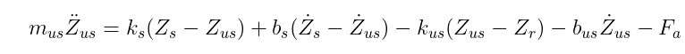
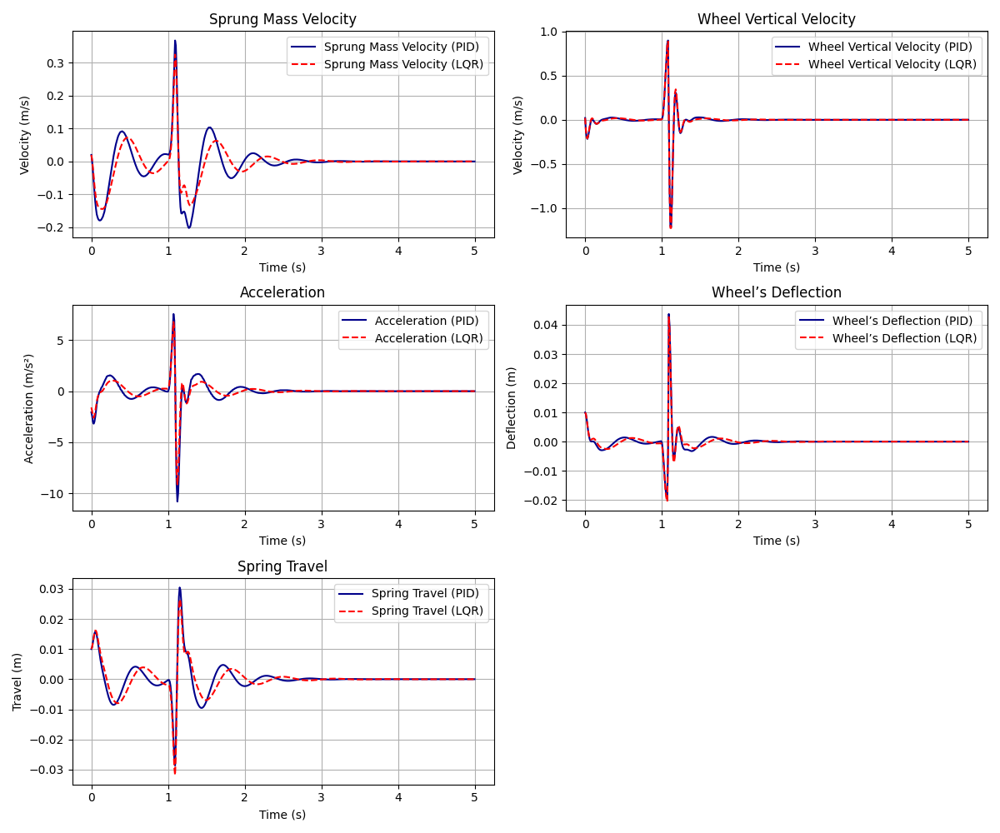

# Comparsion of the performance of active suspension system for a OQV, when subjected to different road conditions

---

## Table of Contents

- [Overview](#overview)
- [Problem Statement](#problem-statement)
- [System dynamics](#dynamics)
- [Results](#results)
- [Installation and Usage](#installation-and-usage)
- [Project Structure](#project-structure)
- [Bibliography](#bibliography)

---

## **Overview**
This repository hosts a detailed simulation of an active suspension system designed for a quarter-car model. This work was developed as part of the Advanced Control Methods course at Skoltech in 2024, focusing on improving vehicle dynamics under varying road conditions through advanced control techniques such as PID and LQR controllers.

- **Course:** Advanced Control Methods, Skoltech, 2024.
- **Team Members:** Haris Khan, Luis moreno, Amir Habel.
- **Final Presentation:** [[Link to Presentation]](https://docs.google.com/presentation/d/1QHCL57dTlITRUsoKisLSNBh8ljAMnTm1lT-WeIaO3NM/edit#slide=id.g2e06ae9955a_1_902).ttat


## **Problem Statement**
  In modern automotive engineering, achieving optimal ride comfort and handling stability in vehicles remains a significant challenge due to varying road conditions. Traditional passive suspension systems often 
    struggle to balance these requirements due to their fixed parameters, leading to suboptimal performance under diverse or extreme conditions. Active suspension systems, which can dynamically adjust to road 
    irregularities, offer a promising solution. However, the effectiveness of such systems heavily depends on the control strategy employed. This project aims to address the need for a robust comparison of three 
    advanced control algorithms—Linear Quadratic Regulator (LQR), Proportional-Integral-Derivative (PID), and Model Predictive Control (MPC)—for a quarter-vehicle active suspension model. The objective is to 
    determine which controller provides the best compromise between ride comfort (minimizing the vertical acceleration of the sprung mass) and handling stability (ensuring minimal suspension travel and consistent 
    wheel-road contact) across varying road profiles, such as speed bumps and uneven surfaces. This comparison will contribute to the development of more adaptive and efficient active suspension systems in 
    automotive applications.

      
**Significance and Impact:**
  
  The significance of the problem addressed by comparing different control algorithms for active suspension systems in vehicles lies in several key areas of automotive engineering and user experience:

- Enhanced Ride Comfort:

Passenger Experience: Improving the vertical acceleration response of the vehicle's suspension system directly impacts the comfort levels experienced by passengers. By minimizing the jarring and vibrations transmitted through the vehicle's frame from uneven road surfaces, passengers experience a smoother ride.

Long-Distance Travel: For longer journeys, the improved comfort can reduce fatigue and increase overall satisfaction for both drivers and passengers.

- Improved Handling Stability:

Safety: Enhancing handling stability ensures that the vehicle maintains better road contact during various driving conditions. This is crucial for safe maneuvering and braking, especially in adverse weather conditions or on poor road surfaces.

Performance: Better handling stability allows for more precise control of the vehicle, which is particularly important in high-performance or emergency driving scenarios. It ensures that the vehicle responds predictably to driver inputs, reducing the risk of accidents.

- Adaptability to Road Conditions:

Versatility: Active suspension systems that effectively adjust to different road irregularities can make vehicles more versatile and capable of performing well under various driving conditions, from city roads to rugged terrains.

Preventive Maintenance: By dynamically adjusting the suspension settings, the system can potentially reduce the wear and tear on vehicle components, leading to lower maintenance costs and longer vehicle life.

# **System Dynamics:**

  <p align="center">
  
  </p>

  **System Description:**
  
  **The quarter-car model includes:**
  
  - **Sprung mass (ms):** Represents the weight of the vehicle body.
  
  - **Unsprung mass (mus):** Represents the weight of the wheels and other components not supported by the springs.
  
  - **Suspension stiffness (ks):**  The stiffness of the springs supporting the sprung mass.
  
  - **Tire stiffness (kus):** The stiffness of the tires, which act as additional springs.
  
  - **Suspension damping (bs):** Damping component that controls the energy dissipation in the suspension system.
  
  - **Tire damping (bus):** Damping component associated with the tires.
  
  - **Road input (Zr):** Represents the vertical displacement due to road irregularities.

# **Differential Equations:**

 The dynamic behavior of this system is described by two differential equations that model the forces acting on both the sprung and unsprung masses. These equations 
 account for the spring and damping forces, as well as the control force exerted by the active suspension system (Fa).

### Dynamics Equations

1. **Equation for the Sprung Mass (\(m_s\))**:

   <p align="center">
   
   </p>
   
2. **Equation for the Unsprung Mass (\(m_{us}\))**:

    <p align="center">
    
    </p>


 ### States

   The state variables used for modeling and controlling the active suspension system based on a quarter-car model. These state variables, essential for the implementation of both PID and LQR controllers, are 
   outlined as follows:

   - x1 = Zs − Zus: This represents the suspension travel, which is the relative displacement between the sprung mass and the unsprung mass. It is a critical parameter for assessing and controlling the overall 
     suspension behavior, especially in terms of how well the suspension can absorb road irregularities and maintain vehicle stability.

   - x2 = Żs: This is the velocity of the sprung mass. Controlling this state variable is important for minimizing the oscillations of the vehicle's body, thereby improving ride comfort by reducing the impact of 
     bumps and other road surface imperfections.

   - x3 = Zus − Zr: Known as the wheel’s deflection, it measures the relative displacement between the unsprung mass and the road profile. This state is crucial for maintaining proper wheel-road contact, which is 
     fundamental for vehicle safety and handling.

   - x4 = ˙Zus: The vertical velocity of the unsprung mass, which affects how quickly the unsprung mass responds to road surface changes. Controlling this velocity helps in optimizing the interaction between the 
     tire and road, crucial for effective shock absorption and minimizing transmission of road noise and vibrations.

# **Results**
   <p align="center">
    
    </p>

1. Sprung Mass Velocity
   
  Description: This plot shows the velocity of the sprung mass over time. The sprung mass typically represents the vehicle body supported by the suspension.
  
  Red Line (PID): Shows fluctuations that suggest more frequent adjustments or corrections by the PID controller in response to road irregularities, leading to a somewhat less smooth velocity profile.
  
  Blue Line (LQR): Demonstrates a smoother response compared to PID, indicative of the LQR controller's ability to optimize control actions based on a predefined cost function that likely balances performance and 
  control effort.
  
2. Wheel Vertical Velocity
     
  Description: This graph displays the vertical velocity of the wheel, which directly impacts ride comfort and handling by affecting how the wheel interacts with the road surface.
  
  Red Line (PID): Exhibits sharp spikes, reflecting rapid changes in wheel velocity which could correspond to sudden impacts or bumps in the road.
  
  Blue Line (LQR): Similar to the PID, but potentially with slight damping effects that smoothen the response, indicating effective control over the unsprung mass dynamics.
  
3. Acceleration
     
  Description: Shows the acceleration experienced by the vehicle's sprung mass, a critical factor for assessing ride comfort.
  
  Red Line (PID): Displays significant peaks, especially at around 1 second and 2.5 seconds, suggesting strong responses to road bumps or other disturbances.
  
  Blue Line (LQR): While also showing peaks, the LQR line appears to smooth out more quickly than PID, potentially offering a more comfortable ride by minimizing high magnitude accelerations.
  
4. Wheel’s Deflection
   
  Description: This plot measures the deflection of the wheel relative to the vehicle body, which is important for maintaining good tire-road contact.

  Red Line (PID) and Blue Line (LQR): Both lines track closely together, showing similar patterns of deflection. This indicates that both controllers are maintaining comparable wheel positioning, which is crucial 
  for effective shock absorption and overall stability.
  
-5. Spring Travel

  Description: Represents the travel of the suspension spring, which is directly related to how well the suspension can absorb road shocks and maintain vehicle stability.
  
  Red Line (PID): The PID controller shows more variability in spring travel, which can be interpreted as a more reactive or less consistent damping strategy.
  
  Blue Line (LQR): Exhibits smoother transitions and less extreme changes in spring travel, suggesting better overall control of suspension movement and potentially enhanced ride quality.

   <p align="center">
    
    </p>
  
**Analysis Summary:**
  These graphs collectively demonstrate the dynamic behavior of the vehicle's suspension system as controlled by PID and LQR strategies under simulated conditions. The LQR controller generally shows smoother   responses and potentially better performance in terms of ride comfort and handling stability compared to the PID controller. This could be attributed to the LQR's approach to minimizing a cost function that likely includes terms for control effort and deviation from desired states, thus achieving a more balanced and optimized response.
  
  Both controllers are effective, but the choice between them may depend on specific performance criteria, such as the priority between ride comfort (where LQR may excel) and responsiveness (where PID may provide sharper control).

# **Installation and Usage:**

**Prerequisites**

Ensure you have Python installed on your system. It's recommended to use Python 3.6 or newer. Download Python from python.org.

**Cloning the Repository**

 First, clone the repository to your local machine by running:
 
 ``` bash
 [git clone https://github.com/your-username/your-repository-name.git](https://github.com/HARISKHAN-1729/Policies-comparsion-3-DOF-suspension-system-OQV-.git)
 cd your-repository-name
 ```

**Setting Up a Virtual Environment**
 
 It's recommended to use a virtual environment to isolate package dependencies. To set up and activate a virtual environment:

** Windows:**

``` bash
py -m venv env
env\Scripts\activate
```

**macOS and Linux:**

```bash
python3 -m venv env
source env/bin/activate
```

**Installing Dependencies**
  
  Install all the required packages by running:

``` bash
pip install -r requirements.txt
```
This command installs all the dependencies defined in your requirements.txt file.

**Running the Project**

To execute the main program, use the following command:

``` bash 
python main.py
```

This will run the main.py script, which should be the entry point of your project.

**Generating Plots**

If your project includes visualizations, generate plots by executing:

``` bash
python plot.py
```

Ensure that plot.py is properly configured to display or save the necessary plots.

**Deactivating the Virtual Environment**

After you are finished, you can deactivate the virtual environment by running:

``` bash

deactivate
```

This command will return your terminal to the system's default Python interpreter.

Conclusion

These instructions provide a complete guide to setting up and running the project. By following these steps, users can ensure they are working in a controlled and consistent development environment.

