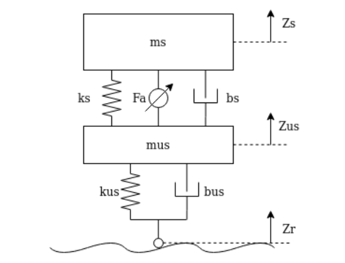

# Comparsion of the performance of active suspension system for a OQV, when subjected to different road conditions

---

## Table of Contents

- [Overview](#overview)
- [Problem Statement](#problem-statement)
- [Methodology](#methodology)
- [Results](#results)
- [Installation and Usage](#installation-and-usage)
- [Project Structure](#project-structure)
- [Bibliography](#bibliography)

---

## **Overview**
This repository hosts a detailed simulation of an active suspension system designed for a quarter-car model. This work was developed as part of the Advanced Control Methods course at Skoltech in 2024, focusing on improving vehicle dynamics under varying road conditions through advanced control techniques such as PID and LQR controllers.

- **Course:** Advanced Control Methods, Skoltech, 2024.
- **Team Members:** Haris Khan, Luis moreno, Amir Habel.
- **Final Presentation:** [[Link to Presentation]](https://docs.google.com/presentation/d/1QHCL57dTlITRUsoKisLSNBh8ljAMnTm1lT-WeIaO3NM/edit#slide=id.g2e06ae9955a_1_902).ttat

## **Problem Statement**
- Introduction:
  
  The performance of a vehicle's suspension system is pivotal in defining both the ride quality for passengers and the handling characteristics for drivers. Traditional passive suspension systems, consisting of        fixed-setting springs and dampers, often struggle to maintain an optimal balance between these two critical aspects, particularly across varying and unpredictable road conditions. The rigidity in passive systems 
  means they cannot adapt to changes in road surface, speed, or vehicle load dynamically, which can lead to compromised comfort and safety.

- Challenges with Passive Suspension Systems:
  
  Passive suspensions are inherently limited by their inability to adjust to real-time road dynamics. This limitation manifests in several ways:

  - Ride Comfort:

    Inadequate absorption of road irregularities leads to significant vehicle body vibrations, adversely affecting passenger comfort.
    
  - Handling Performance:
  
    Insufficient dynamic adjustment capabilities during maneuvers such as cornering, braking, or avoiding obstacles can result in suboptimal handling and stability.
    
  - Safety and Wear:
  
    The constant transmission of road shocks through a vehicle not only increases the wear and tear on its structural components but also elevates the risk of loss of contact between the tire and road surface, 
    potentially leading to dangerous driving situations.

   The Promise of Active Suspension Systems:
    
    Active suspension systems represent a technological advancement aimed at addressing these shortcomings. By utilizing adjustable components that can change their stiffness and damping characteristics in real- 
    time, active suspensions provide a more adaptable solution. They react to road inputs by actively controlling the suspension setup, thus maintaining vehicle stability and passenger comfort across a broader range 
    of conditions.

  # **Objectives of This Project:**
    
    The primary goal of this project is to demonstrate the superiority of different policies for active suspension systems using a quarter-car model, when subjected to different road conditions. Through the simulation, we aim to:

    - Optimize Ride Quality:
    
      By minimizing the vertical acceleration of the sprung mass, thereby reducing the sensation of road bumps and enhancing overall passenger comfort.
      
    - Enhancing Body Motion Control:
      
      Minimize bounce, pitch, and roll during cornering and braking to stabilize the sprung mass and maintain its nominal position.
      
    - Improving Vehicle Handling:
      
      Enhance the vehicle's ability to respond correctly to driver commands, particularly under critical conditions, by minimizing the displacement between the sprung and unsprung mass. 

      
    - Evaluate Control Strategies:
      Specifically, the project compares two types of control methods:
      
      - Proportional-Integral-Derivative (PID) Control:
        
        A widely used control strategy that adjusts the control inputs based on error, its integral over time, and its derivative.
        
      -  Linear Quadratic Regulator (LQR) Control:
        
        An optimal control strategy that aims to minimize a quadratic cost function, balancing the state and control efforts.
      
  **Significance and Impact:**
  
    The outcomes of this project have implications for automotive design and safety standards, particularly in how vehicles are engineered to cope with increasing demands for passenger comfort and vehicle agility. 
    By scientifically validating the performance benefits of active suspension systems, this research could influence future regulatory standards for automotive safety and environmental impact, considering that 
    improved handling can contribute to more efficient driving patterns and lower emissions.

# **System Dynamics:**

  

  
  

  **System Description:**
  
  **The quarter-car model includes:**
  
  - **Sprung mass (ms):** Represents the weight of the vehicle body.
  
  - **Unsprung mass (mus):** Represents the weight of the wheels and other components not supported by the springs.
  
  - **Suspension stiffness (ks):**  The stiffness of the springs supporting the sprung mass.
  
  - **Tire stiffness (kus):** The stiffness of the tires, which act as additional springs.
  
  - **Suspension damping (bs):** Damping component that controls the energy dissipation in the suspension system.
  
  - **Tire damping (bus):** Damping component associated with the tires.
  
  - **Road input (Zr):** Represents the vertical displacement due to road irregularities.

# **Differential Equations:**

 The dynamic behavior of this system is described by two differential equations that model the forces acting on both the sprung and unsprung masses. These equations 
 account for the spring and damping forces, as well as the control force exerted by the active suspension system (Fa).

### Dynamics Equations

1. **Equation for the Sprung Mass (\(m_s\))**:

   -b_s(\dot{Z}_s-\dot{Z}_{us})&plus;F_a&space;))

2. **Equation for the Unsprung Mass (\(m_{us}\))**:

   

